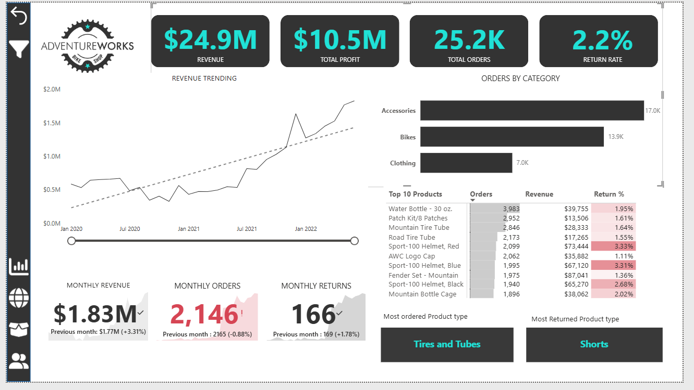
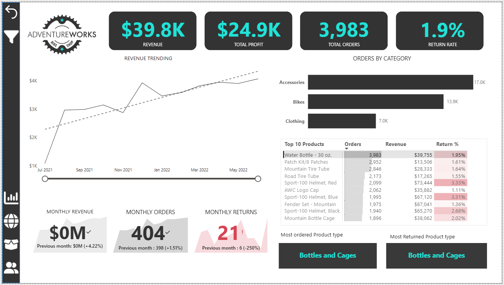
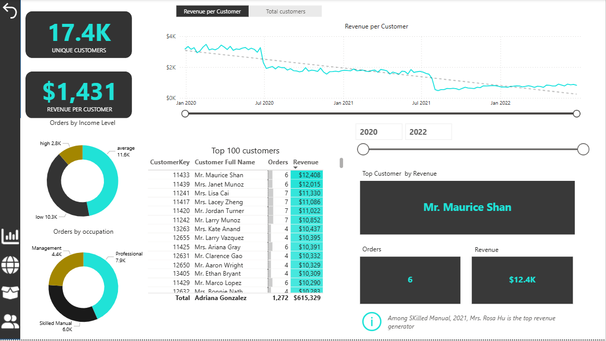

# AdventureWorks-PowerBI-

This project showcases a set of Power BI dashboards built using the AdventureWorks dataset as part of a structured Power BI learning program. The dashboards analyze sales performance, customer behavior, product trends, and geographic distribution, and are designed to support executive and business decision-making through clear KPIs, trends, and drill-down insights.

## Executive Overview Dashboard

*** **Purpose** 
Provides a high-level view of overall business performance, enabling executives to quickly assess revenue, profit, total orders, and return rates in one place.

*** **Key Insights**

**1. Executive Overview KPIs** 
The dashboard shows strong overall revenue and profit growth over time, with clear visibility into monthly trends and performance direction.

**2. Product Performance Drill-Down** 
Drilling into the top-selling product (30 oz Water Bottle) shows stable revenue growth, strong order volume, and a relatively low return rate, indicating a consistently strong performer within its category.

**3. Orders by category** 
Accessories account for the highest share of total orders, followed by Bikes and Clothing. This highlights where customer demand is most concentrated and where category-level planning and optimization efforts can be focused.

## Customer Performance Dashboard

*** **Purpose** 
Analyzes customer-level performance to understand revenue per customer trends, identifies top revenue contributors, and assesses customer concentration and segmentation.
*** **Key Insights**
1. Revenue per customer shows a declining trend from 2020 to 2022, indicating reduced customer spending or margin pressure over time.
2. A small group of top customers contributes a disproportionate share of total revenue, highlighting potential revenue concentration risk.
3. Orders are primarily driven by average-to-high income customers and professional occupations, identifying the core customer segments.
4. Despite a large customer base (17.4K customers), average revenue per customer remains relatively low, suggesting volume-driven growth.

